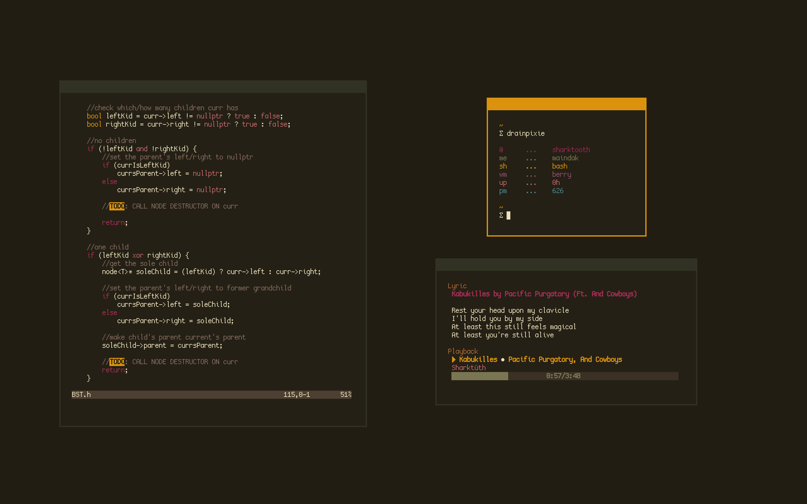
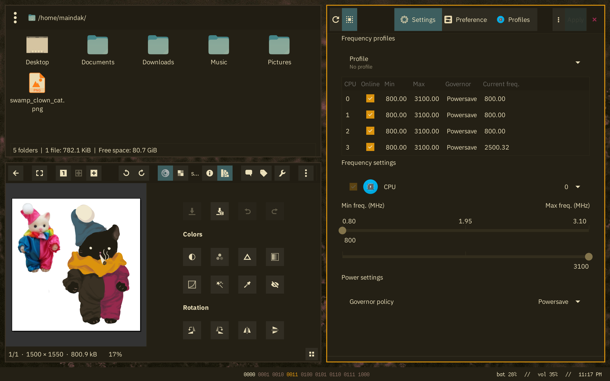
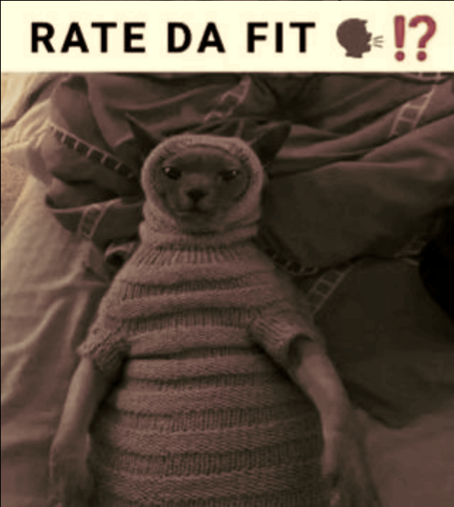

    
     
    A dark, Gruvbox-inspired colour scheme for Neovim. 
    Currently only exists as an NvChad theme file. 

## Gallery

## Credits
- [Gruvbox](https://github.com/morhetz/gruvbox), obviously.
- [NvChad](https://nvchad.com/) for their base46 plugin.
- [Elkowar](https://github.com/elkowar/gtk)'s fork of [Phocus](https://github.com/phocus/gtk) for the GTK theme
- [Cascade](https://github.com/andreasgrafen/cascade) for the Firefox CSS
- [Joinemm](https://github.com/joinemm/discord-css/blob/master/gruvbox.css)'s  Discord CSS
- Coolors.co