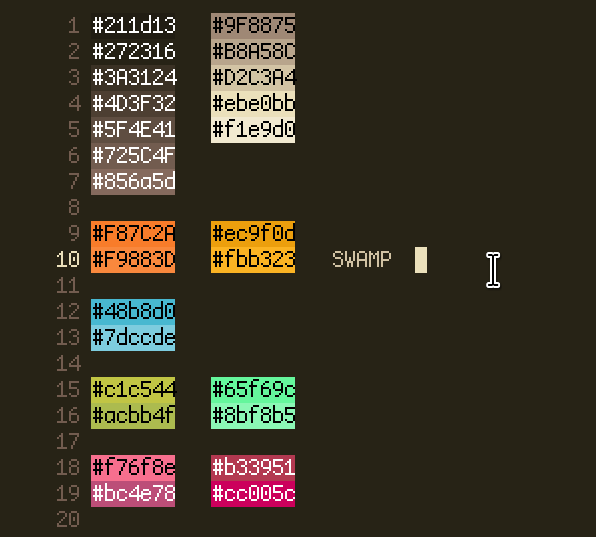
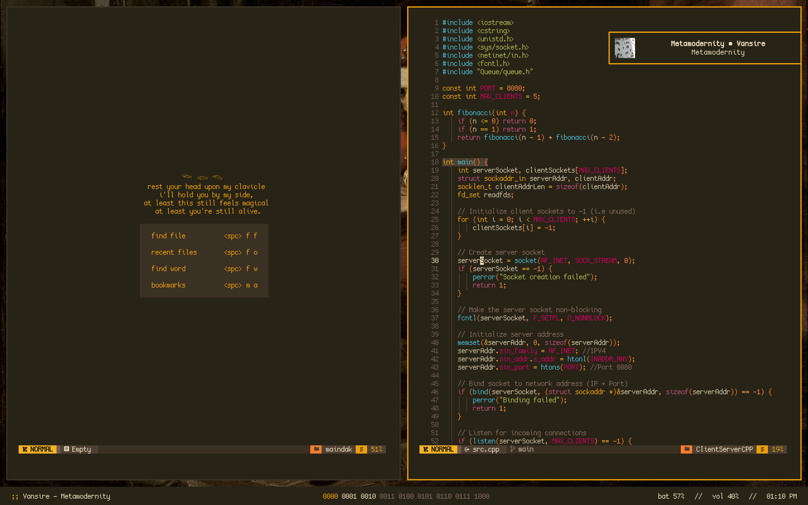
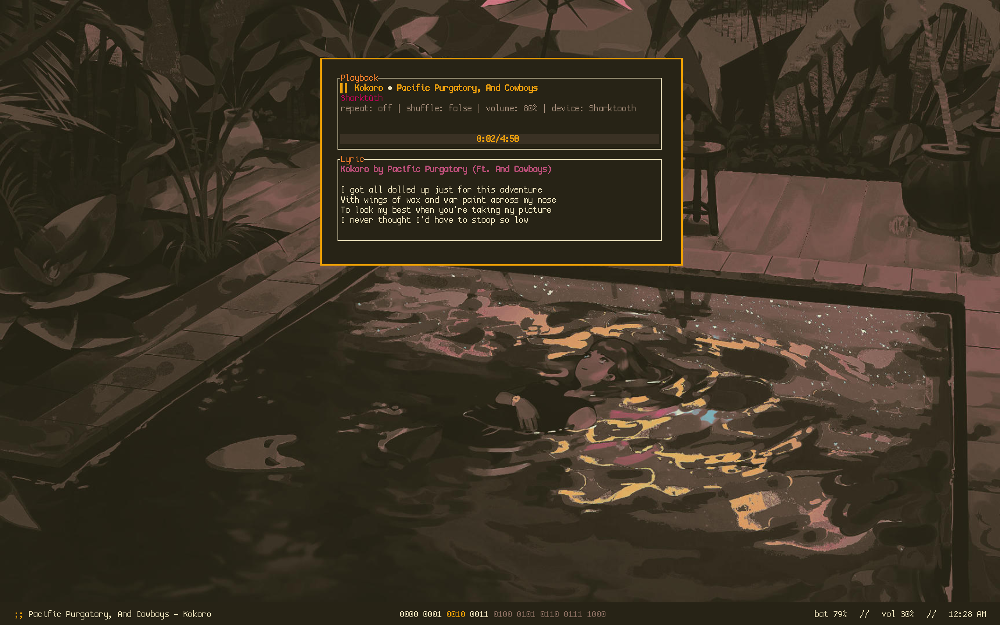

# SWAMP.NVIM

    

A dark, Gruvbox-inspired colour scheme for Neovim. Currently only exists as a base46 theme for NvChad.

 

 

 

 

## Credits
- [Gruvbox](https://github.com/morhetz/gruvbox), obviously.
- [NvChad](https://nvchad.com/) for their base46 plugin.
- [Elkowar](https://github.com/elkowar/gtk)'s fork of [Phocus](https://github.com/phocus/gtk) for the GTK theme
- [Simplefox](https://github.com/migueravila/SimpleFox) for the Firefox CSS
- [Joinemm](https://github.com/joinemm/discord-css/blob/master/gruvbox.css)'s  Discord CSS
- Coolors.co